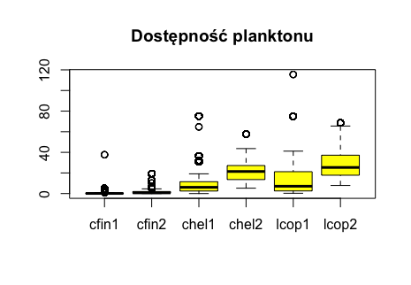
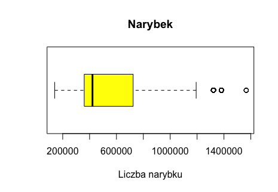
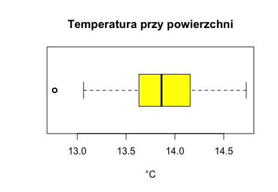
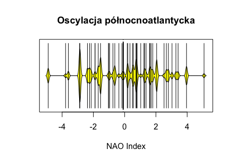
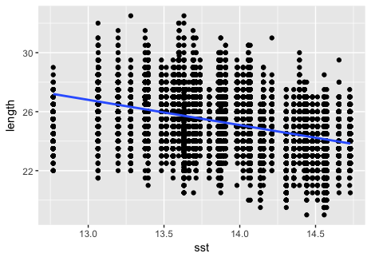
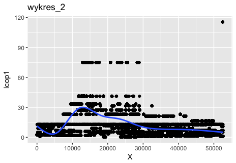
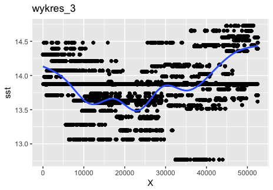

*Projekt Sledzie*
=================

author: Aleksander Cybulski
===========================

date: 23 maja, 2018
===================

-   [Wstep oraz podsumowanie analizy](#wstep-oraz-podsumowanie-analizy)
-   [Biblioteki oraz opis danych](#biblioteki-oraz-opis-danych)
-   [Wartosci puste](#wartosci-puste)
-   [Graficzna analiza](#graficzna-analiza)
-   [Badanie korelacji](#badanie-korelacji)
-   [Wykres przedstawiający rozmiar ryby](#wykres-przedstawiajacy-rozmiar-ryby)
-   [Regresor przewidujący rozmiar ryby](#regresor-przewidujacy-rozmiar-ryby)

Wstep oraz podsumowanie analizy
=================================

Celem przeprowadzonego badania jest analiza wielkości śledzia oceanicznego wyławianego w wodach Europy na podstawie pomiarów dokonywanych przez ostatnie 60 lat. Dane pobrane zostały z połowów jednostek komercyjnych.

W wyniku przeprowadzonej analizy można zauważyć, że wielkość śledzia uzależniona jest od temperatury wody przy powierzchni wody na którą silny wpływ ma oscylacja północnoatlantycka. Wielkość śledzia oceanicznego uzależniona jest również od zagęszczenia widłonogów gatunku 1.


Biblioteki oraz opis danych
=============================

``` r
#Biblioteki użyte do analizy

library(readr)       
library(knitr)      
library(ggplot2)
library(beanplot)
library(corrplot)    
library(plotly)      
library(caret)       
library(randomForest)
```

``` r
sledzie1 <- read.csv("~/Downloads/sledzie1.csv", na.strings = "?")
```

``` r
head(sledzie1)

  X length   cfin1   cfin2   chel1    chel2   lcop1    lcop2  fbar   recr      cumf   totaln      sst
1 0   23.0 0.02778 0.27785 2.46875       NA 2.54787 26.35881 0.356 482831 0.3059879 267380.8 14.30693
2 1   22.5 0.02778 0.27785 2.46875 21.43548 2.54787 26.35881 0.356 482831 0.3059879 267380.8 14.30693
3 2   25.0 0.02778 0.27785 2.46875 21.43548 2.54787 26.35881 0.356 482831 0.3059879 267380.8 14.30693
4 3   25.5 0.02778 0.27785 2.46875 21.43548 2.54787 26.35881 0.356 482831 0.3059879 267380.8 14.30693
5 4   24.0 0.02778 0.27785 2.46875 21.43548 2.54787 26.35881 0.356 482831 0.3059879 267380.8 14.30693
6 5   22.0 0.02778 0.27785 2.46875 21.43548 2.54787       NA 0.356 482831 0.3059879 267380.8 14.30693
       sal xmonth nao
1 35.51234      7 2.8
2 35.51234      7 2.8
3 35.51234      7 2.8
4 35.51234      7 2.8
5 35.51234      7 2.8
6 35.51234      7 2.8
```

Kolumny w zbiorze danych:

<br>length: długość złowionego śledzia \[cm\];</br> <br>cfin1: dostępność planktonu \[zagęszczenie Calanus finmarchicus gat. 1\];</br> <br>cfin2: dostępność planktonu \[zagęszczenie Calanus finmarchicus gat. 2\];</br> <br>chel1: dostępność planktonu \[zagęszczenie Calanus helgolandicus gat. 1\];</br> <br>chel2: dostępność planktonu \[zagęszczenie Calanus helgolandicus gat. 2\];</br> <br>lcop1: dostępność planktonu \[zagęszczenie widłonogów gat. 1\];</br> <br>lcop2: dostępność planktonu \[zagęszczenie widłonogów gat. 2\];</br> <br>fbar: natężenie połowów w regionie \[ułamek pozostawionego narybku\];</br> <br>recr: roczny narybek \[liczba śledzi\];</br> <br>cumf: łączne roczne natężenie połowów w regionie \[ułamek pozostawionego narybku\];</br> <br>totaln: łączna liczba ryb złowionych w ramach połowu \[liczba śledzi\];</br> <br>sst: temperatura przy powierzchni wody \[°C\]</br> <br>sal: poziom zasolenia wody \[Knudsen ppt\]</br> <br>xmonth: miesiąc połowu \[numer miesiąca\]</br> <br>nao: oscylacja północnoatlantycka \[mb\].</br>

``` r
summary(sledzie1)

       X             length         cfin1             cfin2             chel1            chel2       
 Min.   :    0   Min.   :19.0   Min.   : 0.0000   Min.   : 0.0000   Min.   : 0.000   Min.   : 5.238  
 1st Qu.:13145   1st Qu.:24.0   1st Qu.: 0.0000   1st Qu.: 0.2778   1st Qu.: 2.469   1st Qu.:13.427  
 Median :26290   Median :25.5   Median : 0.1111   Median : 0.7012   Median : 5.750   Median :21.673  
 Mean   :26290   Mean   :25.3   Mean   : 0.4458   Mean   : 2.0248   Mean   :10.006   Mean   :21.221  
 3rd Qu.:39436   3rd Qu.:26.5   3rd Qu.: 0.3333   3rd Qu.: 1.7936   3rd Qu.:11.500   3rd Qu.:27.193  
 Max.   :52581   Max.   :32.5   Max.   :37.6667   Max.   :19.3958   Max.   :75.000   Max.   :57.706  
                                NA's   :1581      NA's   :1536      NA's   :1555     NA's   :1556    
     lcop1              lcop2             fbar             recr              cumf        
 Min.   :  0.3074   Min.   : 7.849   Min.   :0.0680   Min.   : 140515   Min.   :0.06833  
 1st Qu.:  2.5479   1st Qu.:17.808   1st Qu.:0.2270   1st Qu.: 360061   1st Qu.:0.14809  
 Median :  7.0000   Median :24.859   Median :0.3320   Median : 421391   Median :0.23191  
 Mean   : 12.8108   Mean   :28.419   Mean   :0.3304   Mean   : 520366   Mean   :0.22981  
 3rd Qu.: 21.2315   3rd Qu.:37.232   3rd Qu.:0.4560   3rd Qu.: 724151   3rd Qu.:0.29803  
 Max.   :115.5833   Max.   :68.736   Max.   :0.8490   Max.   :1565890   Max.   :0.39801  
 NA's   :1653       NA's   :1591                                                         
     totaln             sst             sal            xmonth            nao          
 Min.   : 144137   Min.   :12.77   Min.   :35.40   Min.   : 1.000   Min.   :-4.89000  
 1st Qu.: 306068   1st Qu.:13.60   1st Qu.:35.51   1st Qu.: 5.000   1st Qu.:-1.89000  
 Median : 539558   Median :13.86   Median :35.51   Median : 8.000   Median : 0.20000  
 Mean   : 514973   Mean   :13.87   Mean   :35.51   Mean   : 7.258   Mean   :-0.09236  
 3rd Qu.: 730351   3rd Qu.:14.16   3rd Qu.:35.52   3rd Qu.: 9.000   3rd Qu.: 1.63000  
 Max.   :1015595   Max.   :14.73   Max.   :35.61   Max.   :12.000   Max.   : 5.08000  
                   NA's   :1584  
```

Wartosci puste
================

W zbiorze występuje 11056 pustych rekordów. Na podstawie podsumowania statystyk można zauważyć, że brakujące wartości występują w danych dotyczących dostępności planktonu (cfin1, cfin2, chel1, chel2, lcop1, lcop2) oraz temperatury przy powierzchni wody (sst). Wartości puste zostały zastąpione średnimi wartościami z danych kolumn.

``` r
df <- sledzie1

df$chel2[which(is.na(df$chel2))] <- mean(df$chel2, na.rm = TRUE)
df$chel1[which(is.na(df$chel1))] <- mean(df$chel1, na.rm = TRUE)
df$cfin1[which(is.na(df$cfin1))] <- mean(df$cfin1, na.rm = TRUE)
df$cfin2[which(is.na(df$cfin2))] <- mean(df$cfin2, na.rm = TRUE)
df$lcop1[which(is.na(df$lcop1))] <- mean(df$lcop1, na.rm = TRUE)
df$lcop2[which(is.na(df$lcop2))] <- mean(df$lcop2, na.rm = TRUE)
df$sst[which(is.na(df$sst))] <- mean(df$sst, na.rm = TRUE)
```

Podsumowanie zbioru danych bez wartości pustych:

``` r
summary(df)

      X             length         cfin1             cfin2             chel1            chel2       
 Min.   :    0   Min.   :19.0   Min.   : 0.0000   Min.   : 0.0000   Min.   : 0.000   Min.   : 5.238  
 1st Qu.:13145   1st Qu.:24.0   1st Qu.: 0.0000   1st Qu.: 0.2778   1st Qu.: 2.469   1st Qu.:13.589  
 Median :26290   Median :25.5   Median : 0.1333   Median : 0.7012   Median : 6.083   Median :21.435  
 Mean   :26290   Mean   :25.3   Mean   : 0.4458   Mean   : 2.0248   Mean   :10.006   Mean   :21.221  
 3rd Qu.:39436   3rd Qu.:26.5   3rd Qu.: 0.3603   3rd Qu.: 1.9973   3rd Qu.:11.500   3rd Qu.:27.193  
 Max.   :52581   Max.   :32.5   Max.   :37.6667   Max.   :19.3958   Max.   :75.000   Max.   :57.706  
     lcop1              lcop2             fbar             recr              cumf        
 Min.   :  0.3074   Min.   : 7.849   Min.   :0.0680   Min.   : 140515   Min.   :0.06833  
 1st Qu.:  2.5479   1st Qu.:17.808   1st Qu.:0.2270   1st Qu.: 360061   1st Qu.:0.14809  
 Median :  7.1229   Median :25.338   Median :0.3320   Median : 421391   Median :0.23191  
 Mean   : 12.8108   Mean   :28.419   Mean   :0.3304   Mean   : 520366   Mean   :0.22981  
 3rd Qu.: 21.2315   3rd Qu.:37.232   3rd Qu.:0.4560   3rd Qu.: 724151   3rd Qu.:0.29803  
 Max.   :115.5833   Max.   :68.736   Max.   :0.8490   Max.   :1565890   Max.   :0.39801  
     totaln             sst             sal            xmonth            nao          
 Min.   : 144137   Min.   :12.77   Min.   :35.40   Min.   : 1.000   Min.   :-4.89000  
 1st Qu.: 306068   1st Qu.:13.63   1st Qu.:35.51   1st Qu.: 5.000   1st Qu.:-1.89000  
 Median : 539558   Median :13.86   Median :35.51   Median : 8.000   Median : 0.20000  
 Mean   : 514973   Mean   :13.87   Mean   :35.51   Mean   : 7.258   Mean   :-0.09236  
 3rd Qu.: 730351   3rd Qu.:14.16   3rd Qu.:35.52   3rd Qu.: 9.000   3rd Qu.: 1.63000  
 Max.   :1015595   Max.   :14.73   Max.   :35.61   Max.   :12.000   Max.   : 5.08000
 
```

Graficzna analiza
===================

``` r
beanplot(df$length, main = "Długość Śledzia", col = "blue", horizontal = TRUE, xlab = "cm")
```


``` r
ggplot(df, aes(length)) + geom_histogram(binwidth = 1) +
theme_update() + ggtitle('Długość śledzia')
```


``` r
boxplot(df[3:8], main = "Dostępność planktonu", col = "yellow")
```



``` r
boxplot(df$recr, main = "Narybek", col = "yellow", xlab = "Liczba narybku", horizontal = TRUE)
```



``` r
boxplot(df$sst, main = "Temperatura przy powierzchni", col = "yellow", xlab = "°C", horizontal = TRUE)
```



``` r
beanplot(df$nao, main = "Oscylacja północnoatlantycka", col = "yellow", xlab = "NAO Index", horizontal = TRUE)
```



Badanie korelacji
===================

``` r
korelacja <- cor(df[2:15])
corrplot(korelacja, title = "Korelacja")
```

Na wykresie można zauważyć ujemną korelacje pomiędzy atrybutem length (długość śledzia), a sst (temp. przy powierzchni wody). Długość śledzi uzależniona jest również od oscylacji północnoatlantyckiej (nao).

Oscylacja Północnoatlantycka (NAO) ma bezpośredni wpływ na plony, gospodarkę wodną, dostawy energii oraz rybołóstwo, a także na powstawanie wód głębinowych, przez co oddziałuje na cyrkulację termohalinową [źródło](http://klimat.czn.uj.edu.pl/enid/ss__Oceany_i_klimat/-_Oscylacja_pn__atlantycka_3nf.html, "źródło informacji"). Korelacja ujemna oznacza, że wzrost temperatury wody powoduje spadek wielkości śledzia. Wzrost temperatury związany jest z dodatnią fazą NAO, co można zauważyć na macierzy korelacji.

Rozmiar śledzia jest także skorelowany z intensywnościa połowów oraz dostępnością planktonu (chel1 - Calanus helgolandicus gat. 1 i lcop1 - widłonogów gat. 1). Natomiast roczny narybek (recr) oraz łączne roczne natężenie połowów w regionie (cumf) cechuje się zerową korelacją z długością ryb.


``` r
ggplot(df, aes(x=sst, y=length)) + geom_point() + geom_smooth(method = "lm") + theme_update()
```



``` r
ggplot(df, aes(x=nao, y=lcop1)) + geom_point() + geom_smooth(method = "lm") + theme_update()
```


Wykres przedstawiajacy rozmiar ryby
=====================================

[Wykres](https://plot.ly/~AleksanderAleksander/1/#/,'wykres')

Regresor przewidujacy rozmiar ryby
====================================

``` r
set.seed(30)
df_regresor <- df %>% 
select(length, cfin1, cfin2, chel1, chel2, lcop1, lcop2, fbar, recr, cumf, totaln, sst, sal, nao)
df_caret <- createDataPartition(y=df_regresor$length, p = .8, list = FALSE) 
train <- df_regresor[df_caret, ]
test <- df_regresor[-df_caret, ]
ctrl <- trainControl (method = "repeatedcv", number = 2, repeats = 5)
```

``` r
rfGrid <- expand.grid(mtry = 1:8)
 ctrl <- trainControl(
     method = "repeatedcv",
     number = 5,
     repeats = 2)
```

``` r
fit <- train(length ~ .,
              data = train,
              method = 'rf',
              trControl = ctrl,
              metric = "RMSE",
              tuneGrid=rfGrid,
              importance = TRUE,
              ntree=20)
             
fit
              
              Random Forest 

42067 samples
   13 predictor

No pre-processing
Resampling: Cross-Validated (5 fold, repeated 2 times) 
Summary of sample sizes: 33655, 33654, 33653, 33652, 33654, 33655, ... 
Resampling results across tuning parameters:

  mtry  RMSE      Rsquared   MAE      
  1     1.188434  0.4817863  0.9422531
  2     1.189283  0.4810572  0.9426709
  3     1.191033  0.4795530  0.9438076
  4     1.193102  0.4777964  0.9452189
  5     1.194908  0.4762580  0.9466072
  6     1.196589  0.4748540  0.9478078
  7     1.197764  0.4738666  0.9486365
  8     1.198330  0.4733779  0.9487065

RMSE was used to select the optimal model using the smallest value.
The final value used for the model was mtry = 1.
```

``` r
fit2 <- train(length ~ .,
            data = test,
            method = 'rf',
            trControl = ctrl,
            metric = "RMSE",
            tuneGrid=rfGrid,
            importance = TRUE,
            ntree=20)
            
fit2
            
Random Forest 

10515 samples
   13 predictor

No pre-processing
Resampling: Cross-Validated (5 fold, repeated 2 times) 
Summary of sample sizes: 8411, 8413, 8412, 8412, 8412, 8412, ... 
Resampling results across tuning parameters:

  mtry  RMSE      Rsquared   MAE      
  1     1.197788  0.4800979  0.9446816
  2     1.200188  0.4780381  0.9461908
  3     1.204453  0.4744535  0.9500494
  4     1.207247  0.4721726  0.9522689
  5     1.210012  0.4698641  0.9545649
  6     1.212844  0.4675913  0.9565005
  7     1.215236  0.4655335  0.9589453
  8     1.215881  0.4650556  0.9590552

RMSE was used to select the optimal model using the smallest value.
The final value used for the model was mtry = 1.            
```

Na podstawie algorytmu Random Forest osiągnięto wyniki miar RMSE oraz Rsquared. Dla zbioru treningowego i testowego algorytm wskazał wartość mtry = 1.

Wielkość śledzia oceanicznego zaczęła maleć po przekroczeniu atrybutu X w wartości około 17000.

``` r
> ggplot(data= df, aes(x=X,y=length)) + geom_point() + geom_smooth() +theme_update() +ggtitle("wykres_1")
```


``` r
ggplot(data= df, aes(x=X,y=lcop1)) + geom_point() + geom_smooth() +theme_update() +ggtitle("wykres_2")
```

Na wykresie\_2 prezentującym zmianę zagęszczenia widłonogów gatunku 1 wyraźnie można zauważyć spadek zagęszczenia atrybutu lcop1 w podobnym punkcie jak na wykresie prezentującym długości śledzia oceanicznego. Potwierdza to zależność pomiędzy atrybutami lcop1 oraz length.



Poniższy wykres ilustruje zmiany temperatury przy powierzchni wody w czasie. W początkowym okresie temperatura spadała, co przełożyło się na wzrost długości śledzia widoczny na wykresie\_1. Wzrost temperatury przy powierzchni wody jest ujemnie skorelowany z długością śledzia co potwierdza analiza wykresu\_1 oraz wykresu\_3.

``` r
ggplot(data= df, aes(x=X,y=sst)) + geom_point() + geom_smooth() +theme_update() +ggtitle("wykres_3")
```


